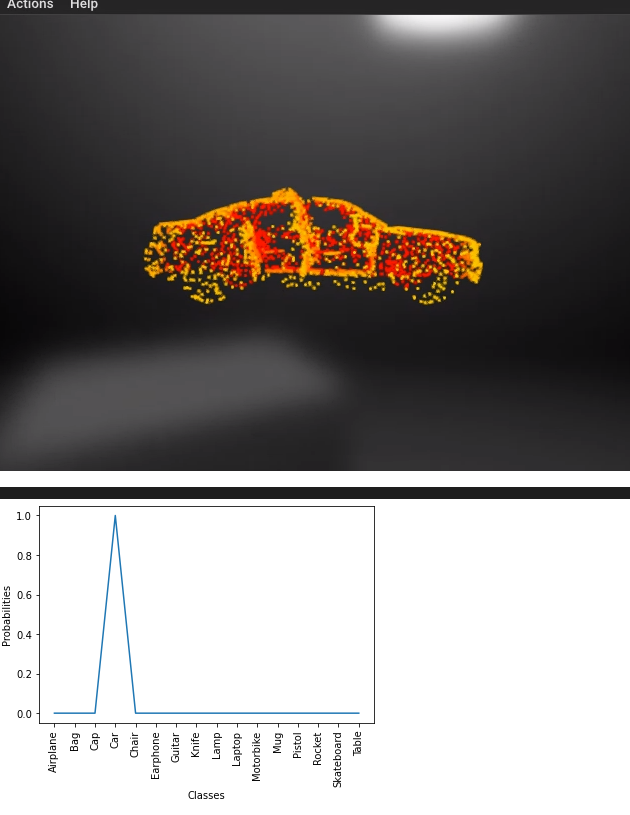
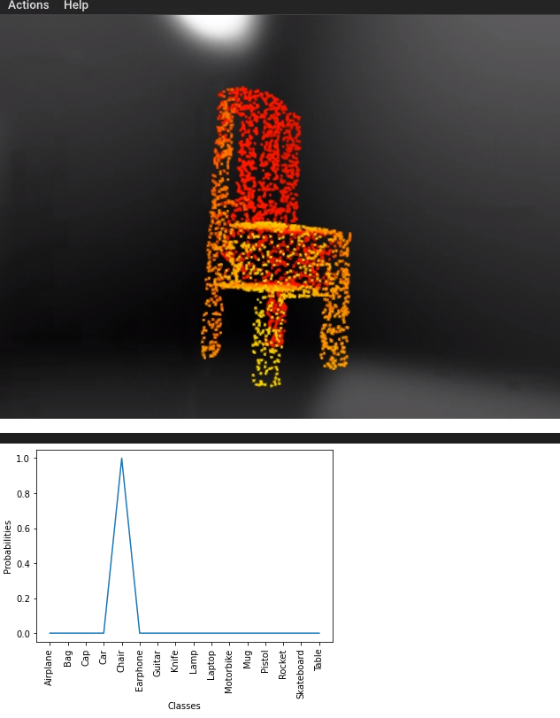
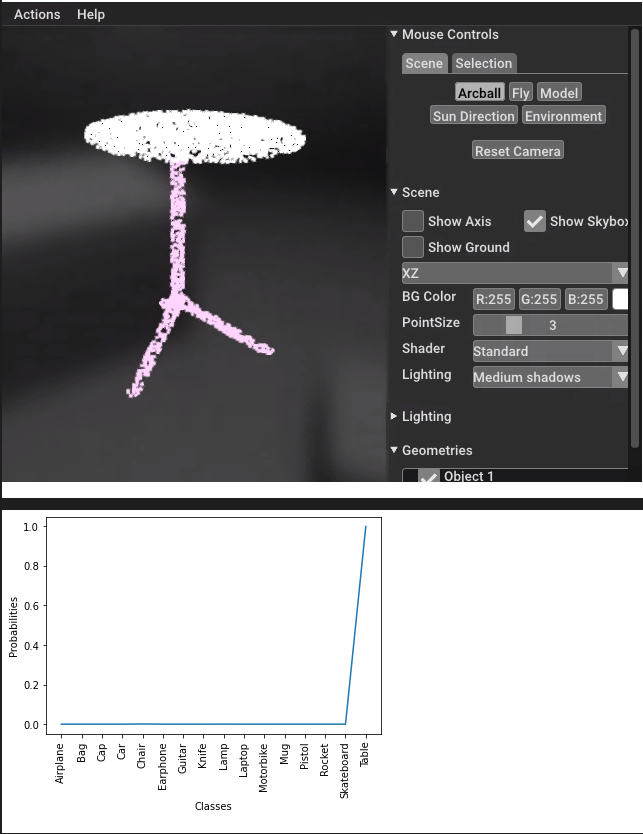

# Deep Learning on Point Clouds

Hi! This project is a Pytorch + Open3D implementation of PointNet. Please note that this implementation does not use Torch Points 3D, however I'm very excited to use it in my next project where I'll use it to classify objects from point clouds scanned on the street using Terrestrial Scanners. 

## About the data

The data used here is the Shapenet dataset released by Stanford. The notebook allows you to download data directly too! The link to that project is below: 

## Pretrained Weights

The pretrained weights for the trained model are in the cls folder. In the notebook, you can train the model and store the weights yourself, as well as load the pretrained weights to try out the classification yourself! 

## Results

Below are the results for the model presented in this notebook. The object to be classified is the above, and below is the label prediction! For example, check out the car below, and it's classification. 

More Results...

## Future Work

The goal for this project was to classify points. The next step is to combine it with a tracking algorithm on an Autonomous Vehicle LiDAR dataset like this one here: 

This would enable real time tracking and classification, and will fit into any perception system in any AV. It will also be interesting to attach a microphone and use it to detect nearby objects based on sound, and create a syncing mechanism to combine results from sound with results from LiDAR. 
